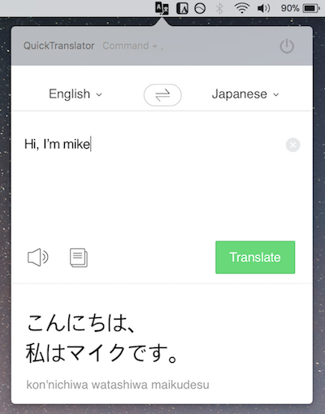

## What is RedCookie
RedCookie is mac os application which provides fastest and easiest translation.

## When can I download this application on my mac?
To distribute the mac os project as package. I need an apple developer membership. 
I applied it at Dec 11, once the apple developer account is created. 
When the account is created, I will do my best to let you download the app from the Mac Appstore as soon as possible.

## How to use
Once you install and run this app. Then type `Command + .` on keyboard. 
RedCookie will be shown as below  

## Support Langauges
* Chinese
* Japanese
* Korean
* English
* Spanish
* French
* Vietnamese Language
* Thai
* Indonesian language

## How to contribute it
I always welcome your contribution! 
If you have any idea on this app. Feel free to try contribute yourself.  

The following is first step to contribute this project.

> $ git clone https://github.com/scalalang2/RedCookie.git 
> $ cd RedCookie 
> $ pod install

If you finished all these steps above. 
Open the `RedCookie.xcworkspace` file with Xcode. 
Now you can build and run it.

## Contributers
* 데스나루 - He helped me to write better expressions in README file.

## Help me.
I'm not very good at English. 
Please help me change all the above description more clearly.
