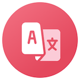

## What is RedCookie
RedCookie is an app that lives in your Mac's menu bar and is a convenient and faster way to get things translated.

## Install
You can download this app on our website [RedCookie's official website.](https://scalalang2.github.io/RedCookie/)

## How to use
Once you install and run this app. Then type `Command + .` on keyboard. 
RedCookie will be shown as below  

## Support Langauges
* Chinese
* Japanese
* Korean
* English
* Spanish
* French
* Vietnamese Language
* Thai
* Indonesian language

## How to contribute it
I always welcome your contribution! 
If you have any idea on this app. Feel free to try contribute yourself.  

The following is first step to contribute this project.

> $ git clone https://github.com/scalalang2/RedCookie.git 
> $ cd RedCookie 
> $ pod install

If you finished all these steps above. 
Open the `RedCookie.xcworkspace` file with Xcode. 
Now you can build and run it.

## Contributers
* 데스나루 - He helped me to write better expressions in README file.
